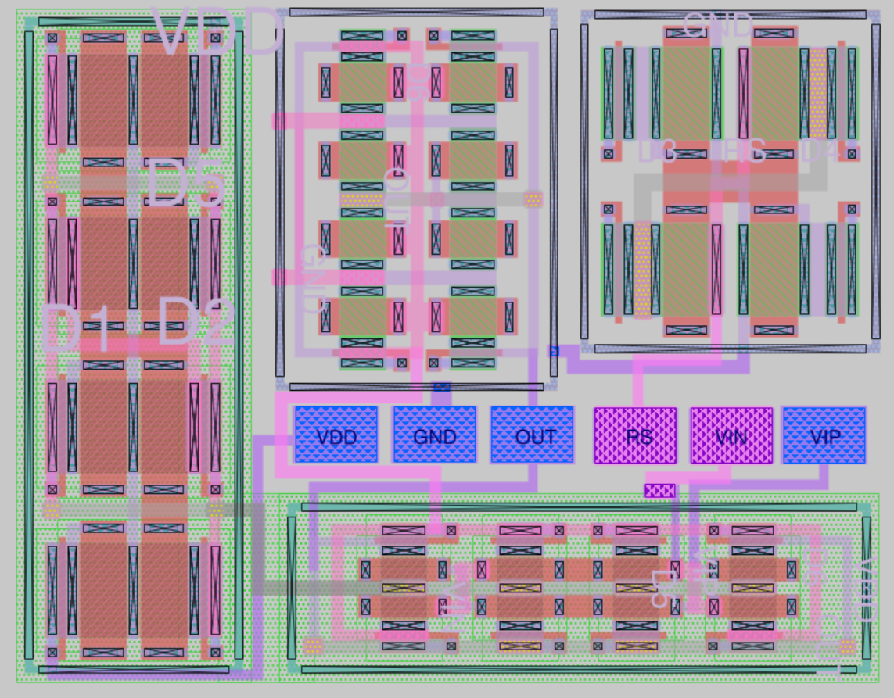

# Op-Amp - Analog IC Design

Op-Amp (Operational Amplifier) adalah komponen penting dalam rangkaian penguatan analog. Proyek ini membangun op-amp dengan membagi komponennya menjadi beberapa sub-bagian sebelum dirakit menjadi satu kesatuan.

## Preview Layout

## Komponen Utama
- `pmoscs` → 3 PMOS + dummy
- `nmosrs` → 2 NMOS + dummy
- `pmos_dif` → 2 PMOS + dummy
- `nmos_dif` → 2 NMOS + dummy

## Hasil LVS
Rangkaian final **tidak match**, karena `nmos_dif` gagal match

## Tools
- Xschem
- Magic VLSI
- Ngspice

